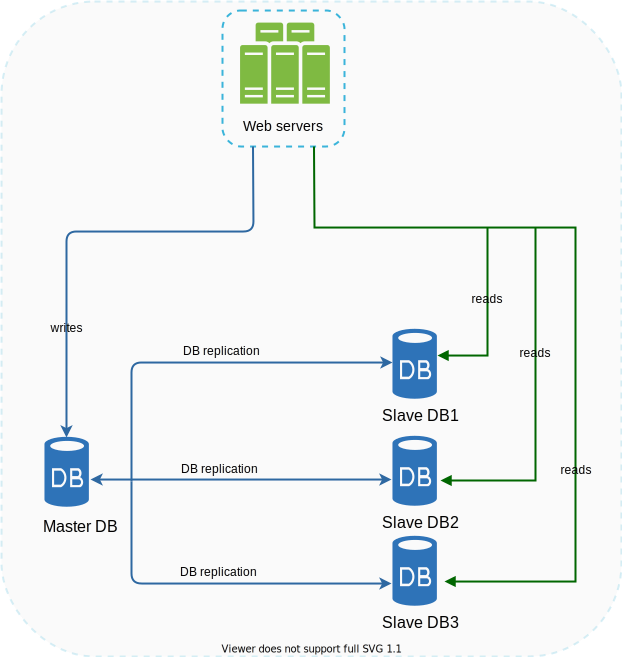

# Systems Design

## A single server
The simplest example of a system is a single server. A single server handles everything. Web
app, database, cache, etc.

In this simple setup, the flow is as follows:
1. The user accesses our website using a domain name. The DNS is a paid service provided by
a 3rd party and not hosted by us.
2. The IP address is returned to the client by the DNS server.
3. Once the client has the IP address, they send an HTTP request directly to our server.
4. The web server returns a response to the client.

### Server + DB
As our user base grows, we need to be able to scale our database. For that, we need to separate
the database from the server. Now we have a web/mobile traffic (web tier) and a database (data tier),
allowing us to scale them independently.

When choosing a DB, we have to make a decision between a relational or a non-relational DB. It
is safest to go with a relation database, also known as a relational database management system
(RDBMS) or SQL database.

However, if your requirements include certain demands, then you should look at a non-relational DB (NoSQL):
* Your application requires super-low latency.
* Your data is unstructured, or you do not have any relational data. (Although you can store
relational data in NoSQL with proper patterns as well.)
* You only need to serialize and deserialize data (JSON, XMl, YAML, etc.)
* You need to store a massive amount of data.

When having to scale systems there are two possible approaches - vertical scaling and horizontal
scaling.

Vertical scaling (scale-up) refers to adding more power (CPU, RAM, etc.) to your servers.

Horizontal scaling (scale-out) refers to adding more servers into your pool of resources.

When traffic is low, vertical scaling is great. The main advantage of it is its simplicity.
You just add more power to a machine. However, there are two major disadvantages:
* Vertical scaling has a hard limit. You cannot add infinite CPU and memory to a single server.
The physical world has its limits.
* Vertical scaling does not have failover and redundancy. If the single server does down, then
the website/app goes down with it.

Horizontal scaling is more desirable for large scale applications due to the limitations of
vertical scaling.

## Adding a load balancer
Regarding the current design, though, as traffic increases, so does the load on a single server.
In order to mitigate that, we can bring in a load balancer.

A load balancer evenly distributes incoming traffic among web servers that are defined in a 
load-balanced set.

The users no longer directly connect to the server, but they connect to the load balancer.
For better security, private IPs are used for communication between servers. A private IP
is an IP address reachable only between servers in the same network; however, it is unreachable
over the internet. The load balancer communicates with web servers through private IPs.

The load balancer has provided us with several benefits:
* If one server goes offline, then all traffic is directed to the other. Our website will no
longer go offline as one server dies. Additionally, the load can be distributed between two
servers now.
* If the traffic grows rapidly, and we need more servers, the load balancer can handle the
problem gracefully. If you add a new server, then the LB will start sending traffic to it 
automatically.

## Database replication
With the LB, we have solved the issue of traffic to our web servers. However, if one DB goes down,
then it's all gone still.

For this, we have a thing called database replication. For this we have a master-slave setup
for the servers. A master DB generally only supports write operations. A slave DB gets copies
of the data from the master and only supports reads. All the data modifying commands like
insert, delete, or update must be sent to the master DB. Most applications require a much higher
ratio of reads to writes; thus, the number of slave DBs in a system is usually larger than the
number of master databases.

Advantages of DB replication:
* Better performance - more queries can be done in parallel for reads.
* Reliability - if one DB gets destroyed, data is still preserved as it's replicated across
multiple physical locations.
* High availability - if one DB goes offline, your website will still be operational.

The setup acts similar to a load balancer in some ways:
* If all slaves go offline, then requests can be redirected to the master DB. If one slave
goes down among the many, then redirection can happen to other healthy slaves.
* If a master DB goes offline, then a slave DB can be promoted to be the new master.  In 
production systems, promoting a new master is more complicated as the data in a slave 
database might not be up-to-date. The missing data needs to be updated by running data 
recovery scripts. There are other replication methods that can help with this, like 
multi-masters and circular replication.

So what does the flow look like now?
1. The user still turns to the DNS.
2. The DNS returns the IP of the load balancer.
3. The user hits the load balancer and gets routed to either server 1 or 2.
4. A web server reads user data from one of the slave DBs. A web server routes any data modifying
operations to the master.

## Adding caching
A cache is a temporary storage area that stores the result of expensive responses or frequently 
accessed data in memory so that subsequent requests are served more quickly.

The cache tier is a temporary data store layer, much faster than the database. The benefits 
of having a separate cache tier include better system performance, ability to reduce 
database workloads, and the ability to scale the cache tier independently.

Caching can have different strategies. Read-through would be the easiest - if the cache does
not have something, then hit the database and store it. Next request will get the stored
data.

Some considerations for using caching:
* Caching should be considered for data that is read frequently, but modified infrequently.
* Implement an expiration policy. Too long and data becomes stale, too short and a cache loses
its point.
* Consistency. Data modifying actions should go hand in hand with cache clearing.
* Mitigating failures. A single cache server represents a single point of failure. A single 
point of failure (SPOF) is a part of a system that, if it fails, will stop the entire 
system from working. Multiple cache servers across different data centers are recommended to
avoid SPOF. Also, it is recommended to overprovision the required memory by a certain
percentage. Provides a buffer should the memory usage increase.
* Eviction policy. The cache can get full, and it'll have to make room somehow.
Least-recently-used (LRU) is the most popular cache eviction policy.

## Content delivery network (CDN)
A CDN is a network of geographically dispersed servers used to deliver static content. 
CDN servers cache static content like images, videos, CSS, JavaScript files, etc.

A CDN closest to the user will deliver the content. This improves load time due to having to
travel less of a distance. However, a first request would take more time.

1. A user requests a resource
2. A CDN checks if it is inside its cache or not. If not, then send a request to the origin.
3. The origin returns to result to the CDN server, which includes an optional HTTP header
Time-to-Live (TTL) which describes for how long to cache.
4. The CDN caches the image and returns it to the user. The image remains cached in the CDN
until the TTL expires.
5. Another user sends a request to get the same resource.
6. The resource is returned from the cache as long as the TTL has not expired.

Considerations of using a CDN:
* Cost. CDNs are run by third-party providers, and you are charged for data transfers in and
out of the CDN. Caching infrequently used assets provides no significant benefits so you should
consider moving them out of the CDN.
* Choosing an appropriate cache expiry. Too long and the data may not be fresh anymore, too short
and you'll be hitting the server too often.
* CDN fallback. If the CDN fails, clients should be able to detect the problem and request resources
from the origin.
* Invalidating files. You can remove a file from CDN before it expires by:
  * Invalidate the CDN object using APIs provided by the CDN vendor.
  * Use object versioning to serve a different version of the object. To version an object,
  you can add a parameter to the URL, such as a version number.
    

1. Static files are no longer served by the web server, but from the CDN for better performance.
2. The DB load is lightened by caching data.

## Scaling the web tier
In order to be able to effectively scale the web tier horizontally, then it would be better
for it to be stateless. You can move the data out into persistent storage. Each server can
access data from the databases - this is called a stateless web tier.

A stateful server remembers client data (state) from one request to the next. A stateless
server keeps no state information.

One could still have stateful servers, but then you'd need sticky sessions, which'd cause the
request to hit the same server each time. Adding or removing servers is much more difficult
with this approach. It is also challenging to handle server failures.

In the figure below, the store is moved into NoSQL, but you can move it to wherever. NoSQL
is chosen here because it's easy to scale.

1. Autoscaling means adding or removing web servers automatically based on the traffic load.

